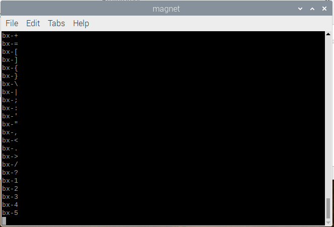

# Magnet wordlist generator


### Notice:

**Note: the creators of *Magnet wordlist generator* are NOT responsible for anything done using the tool.**

### What is Magnet wordlist generator?

Magnet wordlist generator is a simple program that generates wordlists. These wordlists can be used for bruteforcing (I don't recommend bruteforcing as it is illegal).

### How to build?

You will need the GNU C++ compiler to compile. Once the GNU C++ compiler is installed, you will want to run this command:

```g++ main.cpp -o magnet.exe```

Later if you want to run it, you can enter this in the command line:

```./magnet.exe```

(This works on linux, windows, and mac)
